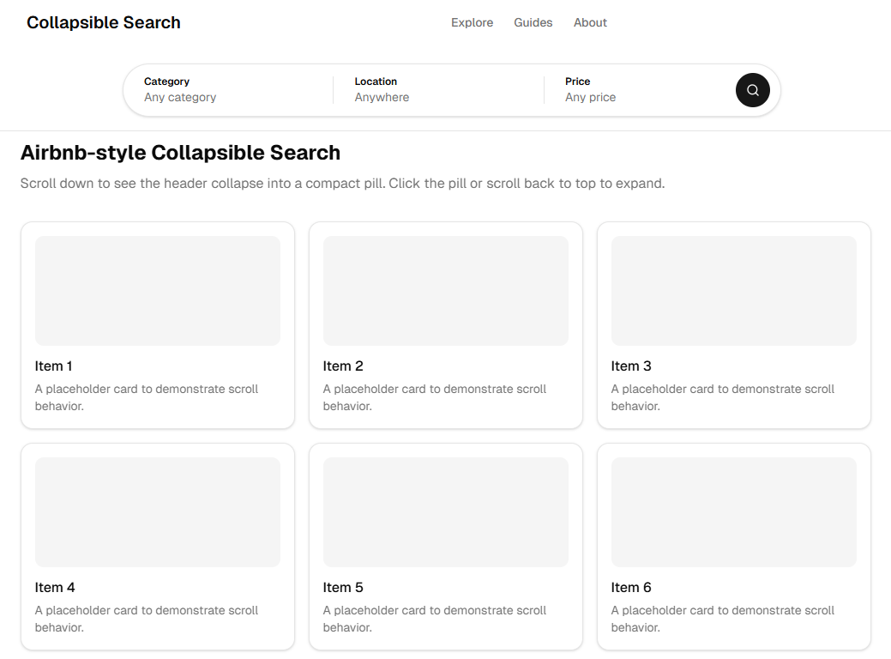

# Collapsible Search

[Русская версия](README.ru.md)

Airbnb-style search header that collapses into a compact pill on scroll.

[Live Demo](https://collapsible-search.vercel.app/)



## Install

Requires React 18+, Tailwind CSS v4, and [shadcn/ui](https://ui.shadcn.com) CSS variables.

**1.** Install the only external dependency:

```bash
npm i lucide-react
```

**2.** Copy these 3 files into your project:

```
components/collapsible-search/
  search-bar-context.tsx   ← context for collapse/expand state
  filter-bar.tsx           ← the search bar with filter dropdowns
  compact-search-bar.tsx   ← the small pill shown when collapsed
```

Done. You own the code — customize freely.

## Usage

```tsx
import { useState } from "react"
import { FilterBar } from "@/components/collapsible-search/filter-bar"

const CATEGORIES = ["Technology", "Design", "Marketing", "Business"]

export function MySearch() {
  const [category, setCategory] = useState<string | null>(null)

  return (
    <FilterBar onSearch={() => console.log({ category })}>
      <FilterBar.Item
        label="Category"
        value={category}
        placeholder="Any category"
        onClear={() => setCategory(null)}
      >
        {(next) =>
          CATEGORIES.map((item) => (
            <button
              key={item}
              onClick={() => { setCategory(item); next() }}
              className="w-full rounded-lg px-3 py-2 text-left text-sm hover:bg-muted"
            >
              {item}
            </button>
          ))
        }
      </FilterBar.Item>
    </FilterBar>
  )
}
```

Add more `<FilterBar.Item>` for each filter. When the user picks a value, call `next()` to auto-advance to the next filter.

### Collapsible header

To get the full scroll-collapse behavior (search bar shrinks into a pill, expands back on scroll-to-top), see the working example in [`src/components/example/`](src/components/example/):

- [`collapsible-header.tsx`](src/components/example/collapsible-header.tsx) — header with scroll listener, compact pill, expand/collapse
- [`example-search.tsx`](src/components/example/example-search.tsx) — 3 filters wired to the header via `useSearchBar()`
- [`demo-page.tsx`](src/components/example/demo-page.tsx) — full page putting it all together

## Run the demo

```bash
git clone https://github.com/Imba-Sharik/collapsible-search.git
cd collapsible-search
npm install
npm run dev
```

Open [http://localhost:3000](http://localhost:3000) and scroll down.

---

<details>
<summary><strong>API Reference</strong></summary>

### FilterBar

| Prop | Type | Default | Description |
|---|---|---|---|
| `onSearch` | `() => void` | — | Search button callback (renders button on last item) |
| `searchLabel` | `string` | `"Search"` | Search button text |
| `defaultActive` | `number \| null` | `null` | Initially open filter index |
| `onActiveChange` | `(i: number \| null) => void` | — | Active filter changed |
| `className` | `string` | — | Root wrapper classes |
| `dropdownClassName` | `string` | — | Dropdown container classes |

### FilterBar.Item

| Prop | Type | Default | Description |
|---|---|---|---|
| `label` | `string` | required | Filter name (e.g. "Category") |
| `value` | `string \| null` | required | Selected value, `null` if empty |
| `placeholder` | `string` | required | Shown when value is null |
| `onClear` | `() => void` | — | Clear button (shown when active + has value) |
| `flex` | `number` | `1` | Width ratio relative to other items |
| `children` | `(next: () => void) => ReactNode` | required | Dropdown content. Call `next()` to advance. |

### CompactSearchBar

| Prop | Type | Description |
|---|---|---|
| `labels` | `string[]` | Text labels in the pill |
| `onExpand` | `(index?: number) => void` | Click handler |

### useSearchBar()

Hook for connecting your search to a collapsible header.

| Field | Type | Description |
|---|---|---|
| `isCollapsed` | `boolean` | Is the bar collapsed? |
| `expandIndex` | `number \| null` | Filter to open on expand |
| `collapse(labels, hasFilters)` | `fn` | Collapse with these labels |
| `expand(index?)` | `fn` | Expand, optionally open a filter |
| `updateLabels(labels)` | `fn` | Update pill labels |
| `reportDropdownOpen(open)` | `fn` | Block scroll-collapse while dropdown is open |

</details>

## License

MIT
